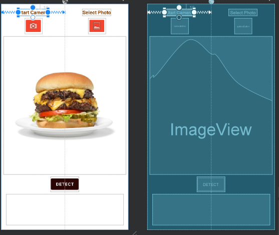

# Android Food Labeling App Tutorial

## Overview
My platform focus topic for my semester project in CIS 357 is TensorFlow for Android. TensorFlow is an open-source library for machine learning and artificial intelligence. TensorFlow Lite, or TF Lite, provides APIs for Mobile Apps to use TensorFlow models. The models are optimized to be more efficient on devices like mobile phones.

TensorFlow models are mainly used for use cases such as voice/speech rocognition, text recognition, image recognition, and more. Developers have the ability to create their own machine learning and AI models without getting into all of the nitty-gritty details. Developers can spend more time focusing on the actual logic of their model and TensorFlow will take care of the details behind the scenes. TensorFlow offers many pre-trained models that other developers can implement into their project. This is the case with my mobile application.

TensorFlow Lite converts pre-trained models into a special format that optimizes speed and storage. That is why it is especially useful on smaller capacity devices such as mobile phones or embedded devices like Raspberry Pi. 

For my project I have created a mobile app that allows Android users to take a picture or select a photo from their gallery of a food dish and the app will identify what the dish is. It will give three different options ranked by the probability of what the dish is. The user will also be able to see what these probabilities are. The TF Lite model I used was a food classification model published by Google. A link to the model can be found [here](https://tfhub.dev/google/lite-model/aiy/vision/classifier/food_V1/1). Other ready-to-deploy models can be found at [this link](https://tfhub.dev/).

The model I have chosen to implement into my app has the ability to recognize 2023 different food dishes. It is not able to decide whether or not something is edible or specify ingredients within a dish. If the input image is not of a food dish, or the image is not properly cropped, the output from the model may have no meaning. Google has also noted that the model was trained with a dataset skewed towards North American foods.

In the image below you can see an example of the application classifying the default image, a cheese burger. 


The Android user can click the camera or gallery button to use their own images as input. After they have their desired image, they press detect to get the output and identify their food dish. An example of a real world use case of this app may be if someone was given the opportunity to try some new desserts but they are not sure exactly what dish they are eating. They could take a picture of their food and the app may be able to help them with this identification. These are some of the basics regarding TensorFlow and my app. The next section will provide you with the tools needed to get started in creating the app.

## Getting Started

To create this project you will need to download Android Studio and the TF Lite model I used in the project.

I am using Android Studio Artctic Fox 2020.3.1.
[Click here to download Android Studio](https://developer.android.com/studio/?gclid=Cj0KCQiA47GNBhDrARIsAKfZ2rChT38G7MLmuQwOTddcu6xOzkhQQVl08eC9vcxLCmVM63r8TzfntzsaAo3BEALw_wcB&gclsrc=aw.ds)

[To download the TF Lite model click here](https://tfhub.dev/google/lite-model/aiy/vision/classifier/food_V1/1)

### Setting Up Android Studio
Before the tutorial on how to create the project, it is important to set up Android Studio properly. 
1. First, create a new project in Android Studio. Select *Empty Activity* and press next.
2. Name the project and select where you would like save your project. Make sure your language is _Kotlin_. Set your minimum SDK to _API 23: Android 6.0 (Marshmallow)_. Press **Finish**.
3. We will now import our TF Lite model. Go to **File**-**New**-**Other**-**TensorFlow Lite Model**. Put in where your TF Lite model is located. Press **Finish**. The required dependencies will automatically be imported. 
4. Next, we will need a default image that will appear when the application open. For my app I used [this](https://www.google.com/search?q=burger&tbm=isch&ved=2ahUKEwjC9OTAws30AhWKdqwKHdnbB4AQ2-cCegQIABAA&oq=burger&gs_lcp=CgNpbWcQAzIHCCMQ7wMQJzIECAAQQzIECAAQQzIICAAQgAQQsQMyCAgAEIAEELEDMgcIABCxAxBDMgQIABBDMgQIABBDMgQIABBDMgQIABBDOgUIABCABFCyB1iyB2CICWgAcAB4AIABcogBygGSAQMxLjGYAQCgAQGqAQtnd3Mtd2l6LWltZ8ABAQ&sclient=img&ei=1iOtYcKxJIrtsQXZt5-ACA&bih=809&biw=1707&rlz=1C1CHBF_enUS862US862#imgrc=4vtQUEX9gSl3fM) image of a cheeseburger. However, your image does not matter as long as it is of a single food dish. Android Studio seems to prefer PNG files, so I converted the image to a PNG. 
5. On the far left in Android Studio, select the Resource Manager. Press '**+**' and then **Import Drawables**. Find your image and then press **Next**. Then, press **Import**. 

Now, Android Studio should be all set up in order to create the Food Labeling Application. The following section will be a step-by-step coding tutorial that can be used to create it yourself. 

## Step-By-Step Instructions
### UI
1. The first thing we will do is set up the UI for the application. In _activity_main.xml_, clear any constraints and widgets within the file. We will add a vertical guideline set in the middle of the screen. Then, we will place a textView that is centered between the guideline (to the left of the guideline) and the parent view with a 16dp contraint to the top of the parent view. Make the text within this textview say **Start Camera**. Put another textView on the right of the guideline with the same constraints. Make the text in this textView say **Select Photo**.
2. Now, we will put two ImageButtons below each of these textViews. For the left ImageButton, find clipart for a camera to put inside of it. Set the id of the ImageButton to be **cameraButton**. Make sure it is centered betweent he guideline and parent view and set a top constraint of 8dp to the textView above. On the right side of the guideline, make sure the ImageButton has clipart for 'gallery' within it. This will have the same constraints as the other ImageButton.
3. Now place an ImageView with the picture of your chosen food that is located in **res-drawable** folder. This ImageView will have a constraint of 8dp on its left and right side to the edge of the parent view. There will also be a constraint of 8dp on the top to one of the ImageButtons. Set the _layout_width_ to **match_parent** and the _layout_height_ to 0dp. Set the _id_ to **imageView**.
4. At the very bottom of the parent view put another TextView with the _id_ **resultsTextView**. Create a constraint 16dp to the bottom of the parent from the bottom of the TextView. Place a contraint of 8dp from the left and right of the TextView to the edges of the parent. Set its _layout_width_ to 0dp and its _layout_height_ to 100dp. Make sure there is no text within the TextView. 
5. Now, right above the **resultsTextView**, place a Button. Set the _id_ to **detectButton** and the text within it to say **Detect**. Center it within the parent and set a constraint from the bottom to the top of **resultsTextView** of 8dp. Then, click on **imageView** and create a constraint from the bottom of it to the top of **detectButton** that is 8dp.

If you followed the instructions, your layout should look somewhat like this:


### Adding Functionality
1. We will now add some functionality to the app. In _MainActivity_ add `private var image: ImageView? = null` to the global variables. Within the _onCreate_ function add 
```
val camera = findViewById<ImageButton>(R.id.cameraButton)
val gallery = findViewById<ImageButton>(R.id.galleryButton)
image = findViewById<ImageView>(R.id.imageView)
val detect = findViewById<Button>(R.id.detectButton)
val results = findViewById<TextView>(R.id.resultsTextView)
```
2. Also within _onCreate_ add `camera.setOnClickListener{}`, `gallery.setOnClickListener{}`, and `detect.setOnClickListener{}`. This will allow us to define what happens when one of our buttons are pressed.

### Permissions and Intents
1. Before we continue we msut specify our app requires certain permissions and uses certain hardware. Since our app will be using the user's camera and accessing their photo gallery, we must ask for permissions to do these actions. To start we must add the following to  _AndroidManifest.xml_:
```
<uses-permission android:name="android.permission.CAMERA" />
<uses-permission android:name="android.permission.READ_EXTERNAL_STORAGE" />
<uses-feature android:name="android.hardware.camera" android:required="false" />
```
2. In _MainActivity_ add the following to the top of the class:
```
companion object{
    private const val CAMERA_RESULT = 1
    private const val GALLERY_RESULT = 2
    private const val MY_CAMERA_PERMISSION_CODE = 100
    private const val MY_GALLERY_PERMISSION_CODE = 200
}
```
These will be the request codes for the four things we could possibly do in the app. They are send an intent to take a picture, send an intent to open the gallery and select a picture, request permission to use the camera, and request permission to access the user's photos.

3. Now in our `camera.setOnClickListener` add the following:
```
if(ContextCompat.checkSelfPermission(this, Manifest.permission.CAMERA)
    != PackageManager.PERMISSION_GRANTED){
    requestPermissions(arrayOf(Manifest.permission.CAMERA), MY_CAMERA_PERMISSION_CODE)
}
else{
    val cameraIntent = Intent(MediaStore.ACTION_IMAGE_CAPTURE)
    startActivityForResult(cameraIntent, MainActivity.CAMERA_RESULT)
}
```
This will first check if we have permission to access the camera. If the user has not granted permission, a request for permission will be sent. If permission was already granted, an intent to take a picture and return the result will begin. We will do something similar in `gallery.setOnClickListener`. Add the following code in order to check for permission, and if we already have permission, start an intent to return with an image from their photo gallery:
```
if(ContextCompat.checkSelfPermission(this, Manifest.permission.READ_EXTERNAL_STORAGE)
    != PackageManager.PERMISSION_GRANTED){
    requestPermissions(arrayOf(Manifest.permission.READ_EXTERNAL_STORAGE), MY_GALLERY_PERMISSION_CODE)
}
else{
    val galleryIntent = Intent(Intent.ACTION_PICK)
    galleryIntent.type = "image/*"
    startActivityForResult(galleryIntent, MainActivity.GALLERY_RESULT)
}
```

4. Now we must handle what happens when the user gives or denies permission to use the camera/gallery. Create the following function: `override fun onRequestPermissionsResult(requestCode: Int, permissions: Array<out String>, grantResults: IntArray) { super.onRequestPermissionsResult(requestCode, permissions, grantResults) }`.
5. Within this function we must handle the cases when we return from requesting permission for the camera or gallery. Add the following code to the function:
```
when(requestCode){
    MY_CAMERA_PERMISSION_CODE -> {
        if ((grantResults.isNotEmpty() &&
                    grantResults[0] == PackageManager.PERMISSION_GRANTED)) {
            Toast.makeText(this, "Camera Permission Granted", Toast.LENGTH_LONG).show()
            val cameraIntent = Intent(MediaStore.ACTION_IMAGE_CAPTURE)
            startActivityForResult(cameraIntent, MainActivity.CAMERA_RESULT)
        }
        else {
            Toast.makeText(this, "Camera Permission Denied", Toast.LENGTH_LONG).show()
        }
        return
    }

    MY_GALLERY_PERMISSION_CODE -> {
        if ((grantResults.isNotEmpty() &&
                    grantResults[0] == PackageManager.PERMISSION_GRANTED)) {
            Toast.makeText(this, "Gallery Permission Granted", Toast.LENGTH_LONG).show()
            val galleryIntent = Intent(Intent.ACTION_PICK)
            galleryIntent.type = "image/*"
            startActivityForResult(galleryIntent, MainActivity.GALLERY_RESULT)
        }
        else {
            Toast.makeText(this, "Gallery Permission Denied", Toast.LENGTH_LONG).show()
        }
    }

    else -> {

    }
}
```
This code will start the proper intent when the user grants permission for a particular case, and if the user denies permission to access the camera or gallery, will display a message confirming this with the user. Now that we are able to get permission from the user and start intents to do certain activities, we must handle what happens when we return from these activities.

### Returning From Intent
1. The first thing we must do is introduce four new global variables. Put the following variables at the top of the class:
```
private lateinit var bitmap: Bitmap
private var height = 350
private var width = 350
private var threshold = 350
```
**bitmap** will hold the image that we are trying to detect within our application. A Bitmap splits an image into a coordinate system of pixels. **bitmap** will always hold the image we are working with. **height**, **width**, and **threshold** will hold the height, width, and the largest those two values of the ImageView, respectively.
2. The height and width of the ImageView will vary by screen size, so to determine the actual height and width add the following function:
```
override fun onWindowFocusChanged(hasFocus: Boolean) {
    super.onWindowFocusChanged(hasFocus)
    height = image!!.height
    width = image!!.width
    if(height >= width){
        threshold = height
    }
    else{
        threshold = width
    }
}
```
3. To define what happens when we return from our intents add the following code:
```
override fun onActivityResult(requestCode: Int, resultCode: Int, data: Intent?) {
    super.onActivityResult(requestCode, resultCode, data)
    val results = findViewById<TextView>(R.id.resultsTextView)

    if(requestCode == CAMERA_RESULT){
        if(resultCode == Activity.RESULT_OK && data !== null) {
            results.text = ""
            bitmap = data.extras!!.get("data") as Bitmap
            bitmap = getScaledDownBitmap(bitmap, threshold, true)!!
            image!!.setImageBitmap(bitmap)
        }
    }
    else if(requestCode == GALLERY_RESULT && data != null){
        results.text = ""
        val uri = data.data

        try {
            bitmap = MediaStore.Images.Media.getBitmap(this.contentResolver, uri)
            bitmap = getScaledDownBitmap(bitmap, height, true)!!
            image!!.setImageBitmap(bitmap)
        }catch (e: IOException){
            e.printStackTrace()
        }


    }
}
```
This function defines what will happen when we return from the camera intent and gallery intent. When we return from the gallery intent it sets bitmap equal to the image the user took with their camera. The bitmap is then scaled down to fit the ImageView and is then the image on the ImageView is set to the proper image that was returned. When we return from the gallery intent we get the URI of the selected image that was returned. The URI is used to identify the resource that was selected (in this case a photo). Then, a bitmap is created from this URI and scaled down. The ImageView is then set to the selected photo returned from the intent.
4. Now we must add the _getScaledDownBitmap_ function. Add the following function:
```
private fun getScaledDownBitmap(
    bitmap: Bitmap,
    threshold: Int,
    isNecessaryToKeepOrig: Boolean,
): Bitmap? {
    val width = bitmap.width
    val height = bitmap.height
    var newWidth = width
    var newHeight = height
    if (width > height && width > threshold) {
        newWidth = threshold
        newHeight = (height * newWidth.toFloat() / width).toInt()
    }
    if (width in (height + 1)..threshold) {
        //the bitmap is already smaller than our required dimension, no need to resize it
        return bitmap
    }
    if (width < height && height > threshold) {
        newHeight = threshold
        newWidth = (width * newHeight.toFloat() / height).toInt()
    }
    if (height in (width + 1)..threshold) {
        //the bitmap is already smaller than our required dimension, no need to resize it
        return bitmap
    }
    if (width == height && width > threshold) {
        newWidth = threshold
        newHeight = newWidth
    }
    return if (width == height && width <= threshold) {
        //the bitmap is already smaller than our required dimension, no need to resize it
        bitmap
    } else getResizedBitmap(bitmap, newWidth, newHeight, isNecessaryToKeepOrig)
}
```
What this function does is determine what the new height and new width of the bitmap should be to fit the ImageView. It considers multiple cases to determine how to best keep the aspect ratio of the image.
5. In _getScaledDown_ we called _getResizedBitmap_. Add the following function:
```
private fun getResizedBitmap(
    bm: Bitmap,
    newWidth: Int,
    newHeight: Int,
    isNecessaryToKeepOrig: Boolean,
): Bitmap? {
    val widthBitmap = bm.width
    val heightBitmap = bm.height
    val scaleWidth = newWidth.toFloat() / widthBitmap
    val scaleHeight = newHeight.toFloat() / heightBitmap
    // CREATE A MATRIX FOR THE MANIPULATION
    val matrix = Matrix()
    // RESIZE THE BIT MAP
    matrix.postScale(scaleWidth, scaleHeight)

    // "RECREATE" THE NEW BITMAP
    val resizedBitmap = Bitmap.createBitmap(bm, 0, 0, widthBitmap, heightBitmap, matrix, true)
    if (!isNecessaryToKeepOrig) {
        bm.recycle()
    }
    return resizedBitmap
}
```
This function takes the new height and new width of the bitmap and scales the bitmap down to the proper size. This resized bitmap is then returned. We now have handled what happens when we return from the two different intents. The app should now allow the user to take a picture and see it within the app upon return. They should also be able to select a photo from their gallery and see it in the app upon return. Now, it is time to add the code that will allow us to use the TensorFlow Lite model to detect and classify the images.
### Detecting The Images


