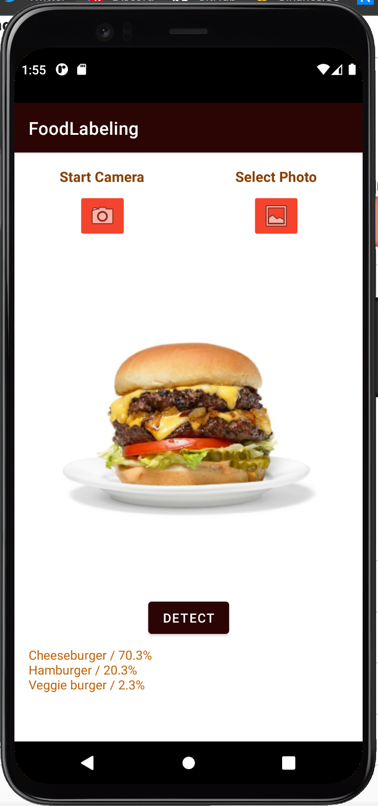

# Android Food Labeling App Tutorial

## Overview
My platform focus topic for my semester project in CIS 357 is TensorFlow for Android. TensorFlow is an open-source library for machine learning and artificial intelligence. TensorFlow Lite, or TF Lite, provides APIs for Mobile Apps to use TensorFlow models. The models are optimized to be more efficient on devices like mobile phones.

TensorFlow models are mainly used for use cases such as voice/speech rocognition, text recognition, image recognition, and more. Developers have the ability to create their own machine learning and AI models without getting into all of the nitty-gritty details. Developers can spend more time focusing on the actual logic of their model and TensorFlow will take care of the details behind the scenes. TensorFlow offers many pre-trained models that other developers can implement into their project. This is the case with my mobile application.

TensorFlow Lite converts pre-trained models into a special format that optimizes speed and storage. That is why it is especially useful on smaller capacity devices such as mobile phones or embedded devices like Raspberry Pi. 

For my project I have created a mobile app that allows Android users to take a picture or select a photo from their gallery of a food dish and the app will identify what the dish is. It will give three different options ranked by the probability of what the dish is. The user will also be able to see what these probabilities are. The TF Lite model I used was a food classification model published by Google. A link to the model can be found [here](https://tfhub.dev/google/lite-model/aiy/vision/classifier/food_V1/1). Other ready-to-deploy models can be found at [this link](https://tfhub.dev/).

The model I have chosen to implement into my app has the ability to recognize 2023 different food dishes. It is not able to decide whether or not something is edible or specify ingredients within a dish. If the input image is not of a food dish, or the image is not properly cropped, the output from the model may have no meaning. Google has also noted that the model was trained with a dataset skewed towards North American foods.

In the image below you can see an example of the application classifying the default image, a cheese burger. 



The Android user can click the camera or gallery button to use their own images as input. After they have their desired image, they press detect to get the output and identify their food dish. An example of a real world use case of this app may be if someone was given the opportunity to try some new desserts but they are not sure exactly what dish they are eating. They could take a picture of their food and the app may be able to help them with this identification. These are some of the basics regarding TensorFlow and my app. The next section will provide you with the tools needed to get started in creating the app.

## Getting Started

To create this project you will need to download Android Studio and the TF Lite model I used in the project.

I am using Android Studio Artctic Fox 2020.3.1.
[Click here to download Android Studio](https://developer.android.com/studio/?gclid=Cj0KCQiA47GNBhDrARIsAKfZ2rChT38G7MLmuQwOTddcu6xOzkhQQVl08eC9vcxLCmVM63r8TzfntzsaAo3BEALw_wcB&gclsrc=aw.ds)

[To download the TF Lite model click here](https://tfhub.dev/google/lite-model/aiy/vision/classifier/food_V1/1)

### Setting Up Android Studio
Before the tutorial on how to create the project, it is important to set up Android Studio properly. 
1. First, create a new project in Android Studio. Select *Empty Activity* and press next.
2. Name the project and select where you would like save your project. Make sure your language is _Kotlin_. Set your minimum SDK to _API 23: Android 6.0 (Marshmallow)_. Press **Finish**.
3. We will now import our TF Lite model. Go to **File**-**New**-**Other**-**TensorFlow Lite Model**. Put in where your TF Lite model is located. Press **Finish**. The required dependencies will automatically be imported. 
4. Next, we will need a default image that will appear when the application open. For my app I used [this](https://www.google.com/search?q=burger&tbm=isch&ved=2ahUKEwjC9OTAws30AhWKdqwKHdnbB4AQ2-cCegQIABAA&oq=burger&gs_lcp=CgNpbWcQAzIHCCMQ7wMQJzIECAAQQzIECAAQQzIICAAQgAQQsQMyCAgAEIAEELEDMgcIABCxAxBDMgQIABBDMgQIABBDMgQIABBDMgQIABBDOgUIABCABFCyB1iyB2CICWgAcAB4AIABcogBygGSAQMxLjGYAQCgAQGqAQtnd3Mtd2l6LWltZ8ABAQ&sclient=img&ei=1iOtYcKxJIrtsQXZt5-ACA&bih=809&biw=1707&rlz=1C1CHBF_enUS862US862#imgrc=4vtQUEX9gSl3fM) image of a cheeseburger. However, your image does not matter as long as it is of a single food dish. Android Studio seems to prefer PNG files, so I converted the image to a PNG. 
5. On the far left in Android Studio, select the Resource Manager. Press '**+**' and then **Import Drawables**. Find your image and then press **Next**. Then, press **Import**. 

Now, Android Studio should be all set up in order to create the Food Labeling Application. The following section will be a step-by-step coding tutorial that can be used to create it yourself. 

## Step-By-Step Instructions


```markdown
Syntax highlighted code block

# Header 1
## Header 2
### Header 3

- Bulleted
- List

1. Numbered
2. List

**Bold** and _Italic_ and `Code` text

[Link](url) and 
```

For more details see [Basic writing and formatting syntax](https://docs.github.com/en/github/writing-on-github/getting-started-with-writing-and-formatting-on-github/basic-writing-and-formatting-syntax).

### Jekyll Themes

Your Pages site will use the layout and styles from the Jekyll theme you have 
selected in your [repository settings](https://github.com/ironsj/Android-Image-Labeling-Project/settings/pages). 
The name of this theme is saved in the Jekyll `_config.yml` configuration file.

### Support or Contact

Having trouble with Pages? Check out our [documentation](https://docs.github.com/categories/github-pages-basics/) or [contact support](https://support.github.com/contact) and we’ll help you sort it out.
